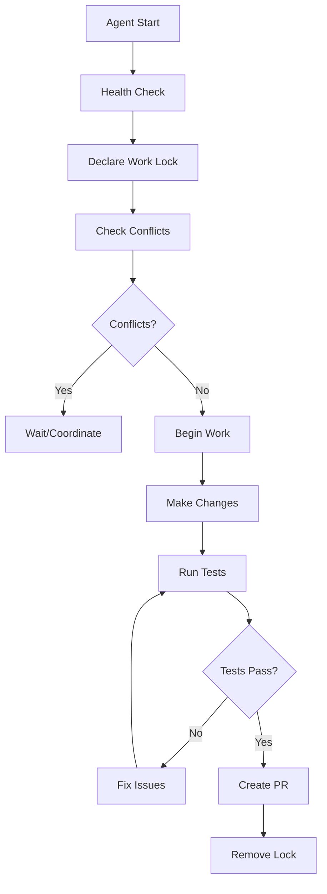

# Packr Multi-Agent System Setup

This document provides everything needed to set up and operate multiple AI agents safely on the Packr codebase.

## 🚀 Quick Start

### 1. System Prompt Setup
Copy the contents of `PACKR_BACKGROUND_AGENT_PROMPT.md` into your Cursor agent configuration:

```markdown
You are the **Packr Background Engineer**. Your mission is **CONTINUOUS MAINTENANCE**...
[Full system prompt from PACKR_BACKGROUND_AGENT_PROMPT.md]
```

### 2. Repository Preparation
```bash
# Make coordinator script executable
chmod +x scripts/agent-coordinator.sh

# Install dependencies
npm install

# Setup test databases
cd packages/database && npx prisma generate && npx prisma db push --force-reset
```

### 3. Agent Coordination Setup
```bash
# Create agent work session
./scripts/agent-coordinator.sh lock background-agent "apps/api/src/routes/orders.ts" "30min"

# Check for conflicts
./scripts/agent-coordinator.sh conflicts "apps/api/src/routes/orders.ts,apps/web/src/components/OrdersList.tsx"

# Run coordinated tests
./scripts/agent-coordinator.sh test api background-agent
```

## 📁 File Structure Overview

### Core Agent Files
```
/workspace/
├── PACKR_BACKGROUND_AGENT_PROMPT.md     # Main system prompt
├── MULTI_AGENT_COORDINATION.md          # Coordination guidelines
├── AGENT_COMMANDS_REFERENCE.md          # Command reference
├── AGENT_SYSTEM_SETUP.md               # This file
├── scripts/
│   └── agent-coordinator.sh            # Coordination utility
├── .github/
│   ├── workflows/
│   │   └── multi-agent-ci.yml          # CI pipeline
│   └── pull_request_template.md        # PR template
└── TESTING.md                          # Existing test documentation
```

### Integration Points
- **CI Pipeline**: `.github/workflows/multi-agent-ci.yml`
- **PR Template**: `.github/pull_request_template.md`
- **Test Infrastructure**: Existing test suites in `apps/*/src/__tests__/`
- **Coordination Tools**: `scripts/agent-coordinator.sh`

## 🤖 Agent Types & Responsibilities

### Background Engineer (`automation/background-maintenance`)
- **Focus**: Repository hygiene, performance, observability
- **Scope**: Small improvements across entire codebase
- **Tests**: All test suites, coverage maintenance
- **Cadence**: Continuous, small batches

### Feature Agents (`feature/*`)
- **Focus**: Specific feature development
- **Scope**: Dedicated areas (orders, chat, inventory)
- **Tests**: Feature-specific test suites
- **Cadence**: Sprint-based development

### Integration Agent (`feature/integration-*`)
- **Focus**: External API integrations (Trackstar)
- **Scope**: Webhook processing, API contracts
- **Tests**: Contract tests, integration tests
- **Cadence**: As needed for integration changes

## 🔧 Operation Workflow

### 1. Agent Startup
```bash
# Health check
./scripts/agent-coordinator.sh health

# Check active agents
./scripts/agent-coordinator.sh list

# Declare work intent
./scripts/agent-coordinator.sh lock <agent-name> <files> <time>
```

### 2. Development Cycle


### 3. Testing Protocol
```bash
# Propose test execution (wait for approval)
echo "I need to run: npm test -- --testPathPattern=orders"

# Run coordinated tests
./scripts/agent-coordinator.sh test api background-agent

# Generate work report
./scripts/agent-coordinator.sh report background-agent
```

## 📋 Safety Checklist

### Before Starting Work
- [ ] Run health check: `./scripts/agent-coordinator.sh health`
- [ ] Check active agents: `./scripts/agent-coordinator.sh list`
- [ ] Create work lock: `./scripts/agent-coordinator.sh lock <agent> <files> <time>`
- [ ] Check for conflicts: `./scripts/agent-coordinator.sh conflicts <files>`

### During Development
- [ ] Follow PLAN → PATCH → TEST → NOTES workflow
- [ ] Make small, reviewable changes
- [ ] Include multitenancy tests (`tenant_id` scoping)
- [ ] Test RBAC scenarios (different user roles)
- [ ] Maintain test coverage thresholds

### Before PR Creation
- [ ] Run full test suite: `./scripts/agent-coordinator.sh test all <agent>`
- [ ] Generate work report: `./scripts/agent-coordinator.sh report <agent>`
- [ ] Remove work lock: `./scripts/agent-coordinator.sh unlock <agent>`
- [ ] Fill out PR template completely

### After PR Merge
- [ ] Clean up feature branch
- [ ] Update agent coordination docs if needed
- [ ] Monitor metrics for any issues

## 🧪 Test Coverage Requirements

### API Tests (80% minimum)
```bash
cd apps/api
npm test -- --coverage --coverageReporters=text-summary
```

### Frontend Tests (70% minimum)  
```bash
cd apps/web
npm test -- --run --coverage
```

### Key Test Categories
- **Unit Tests**: Individual function/component behavior
- **Integration Tests**: API endpoints with database
- **Multitenancy Tests**: Tenant isolation verification
- **Contract Tests**: Trackstar API integration
- **Security Tests**: RBAC and access control

## 🔐 Security & Multitenancy

### Mandatory Patterns
```typescript
// Database queries MUST include tenant scoping
const orders = await db.order.findMany({
  where: {
    tenant_id: user.tenant_id,  // REQUIRED
    brand_id: user.brand_id,    // When applicable
    // ... other conditions
  }
});

// Negative tests MUST verify isolation
it('should not access other tenant data', async () => {
  const tenant1Order = await createOrder(tenant1.id);
  const tenant2User = await createUser(tenant2.id);
  
  await request(app)
    .get(`/api/orders/${tenant1Order.id}`)
    .set('Authorization', tenant2User.token)
    .expect(403);
});
```

### RBAC Test Matrix
- `SUPER_ADMIN`: Can access all resources
- `TENANT_ADMIN`: Tenant resources only
- `BRAND_ADMIN`: Brand resources only  
- `BRAND_USER`: Limited brand resources
- `READ_ONLY`: No write permissions

## 📊 Monitoring & Observability

### Key Metrics to Track
- **API Performance**: p95 response time < 200ms
- **Database Performance**: p95 query time < 50ms
- **Webhook Processing**: p95 lag < 3 minutes
- **Error Rates**: < 0.1% for 5xx responses
- **Test Coverage**: API ≥80%, Frontend ≥70%

### Alerting Thresholds
- Critical errors > 10/minute
- Response time p95 > 500ms
- Webhook lag p95 > 5 minutes
- Test coverage drop > 5%
- Build failure rate > 20%

## 🚨 Emergency Procedures

### Agent Conflict Resolution
```bash
# Stop all agents immediately
./scripts/agent-coordinator.sh cleanup

# Resolve conflicts manually
git status
git diff

# Restart coordination
./scripts/agent-coordinator.sh health
```

### Test Suite Failure
```bash
# Run health check
./scripts/agent-coordinator.sh health

# Run tests individually
cd apps/api && npm test -- --testPathPattern=orders
cd apps/web && npm test -- --run --testPathPattern=Button

# Check for database issues
cd packages/database && npx prisma studio
```

### System Recovery
```bash
# Reset test database
cd packages/database && npx prisma migrate reset --force

# Clear all locks
rm -rf .agent-locks/*

# Restart from clean state  
git stash
git checkout develop
git pull origin develop
```

## 📚 Additional Resources

### Documentation Links
- [Testing Guide](TESTING.md) - Comprehensive test patterns
- [Agent Commands](AGENT_COMMANDS_REFERENCE.md) - Command reference
- [Coordination Guide](MULTI_AGENT_COORDINATION.md) - Multi-agent patterns

### CI/CD Integration
- **GitHub Actions**: `.github/workflows/multi-agent-ci.yml`
- **PR Template**: `.github/pull_request_template.md`
- **Branch Protection**: Configured via GitHub settings

### Troubleshooting
- **Agent Locks**: Check `.agent-locks/` directory
- **Test Reports**: Check `coverage/` directories
- **Work Reports**: Check `.agent-reports/` directory
- **CI Status**: Check GitHub Actions tab

---

## 🎯 Success Metrics

### Development Velocity
- Average time to merge: < 24 hours
- Merge conflict rate: < 5%
- Build failure rate: < 10%
- Test suite execution time: < 10 minutes

### Code Quality
- Test coverage: API ≥80%, Frontend ≥70%
- TypeScript errors: 0
- ESLint errors: 0
- Security vulnerabilities: 0 high/critical

### System Reliability  
- API uptime: > 99.9%
- Database connection success: > 99.9%
- Webhook processing success: > 99.5%
- Data consistency: 100%

This multi-agent system is designed to enable safe, efficient, and high-quality development on the Packr platform while maintaining strict standards for security, testing, and code quality.